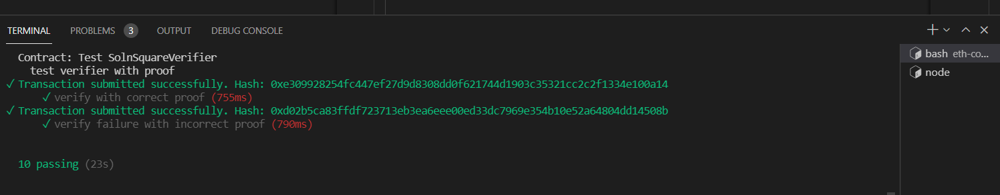

# Udacity Blockchain Capstone

The capstone will build upon the knowledge you have gained in the course in order to build a decentralized housing product. 

Clone this repository:

```
git clone https://github.com/polarbeargo/Blockchain-Capstone.git
```

Change directory to ```eth-contracts``` folder and install all requisite npm packages (as listed in ```package.json```):

```
cd eth-contracts
npm install
```

Launch Ganache:

```
ganache-cli -m "spirit supply whale amount human item harsh scare congress discover talent hamster"
```

In a separate terminal window, Compile smart contracts:

```
truffle compile
```  
This will create the smart contract artifacts in folder ```build\contracts```.

Migrate smart contracts to the locally running blockchain, ganache-cli:

```
truffle migrate
```

Your terminal should look something like this:

```
Compiling your contracts...
===========================
> Everything is up to date, there is nothing to compile.


Starting migrations...
======================
> Network name:    'development'
> Network id:      1650065453004
> Block gas limit: 6721975 (0x6691b7)


2_deploy_contracts.js
=====================

   Deploying 'Verifier'
   --------------------
✓ Transaction submitted successfully. Hash: 0x6e72f2c15bcbbab5b6b834b7894734b5cc4d2c6747636df5e33026c97be0fd73
   > transaction hash:    0x6e72f2c15bcbbab5b6b834b7894734b5cc4d2c6747636df5e33026c97be0fd73
   > Blocks: 0            Seconds: 0
   > contract address:    0x4E89f8aa1791173F5a8FfB21e390eaC6bB7427cc
   > block number:        11
   > block timestamp:     1650068096
   > account:             0x27D8D15CbC94527cAdf5eC14B69519aE23288B95
   > balance:             99.915511
   > gas used:            1051350 (0x100ad6)
   > gas price:           20 gwei
   > value sent:          0 ETH
   > total cost:          0.021027 ETH


   Deploying 'SolnSquareVerifier'
   ------------------------------
✓ Transaction submitted successfully. Hash: 0x7e49076376cd3c5d6d1ed5885aa223b325a1b2aa51c3d13aea7e74717ba49514
   > transaction hash:    0x7e49076376cd3c5d6d1ed5885aa223b325a1b2aa51c3d13aea7e74717ba49514
   > Blocks: 0            Seconds: 0
   > contract address:    0x788D4959f9f29ef088c6F98162165778C765Fee6
   > block number:        12
   > block timestamp:     1650068097
   > account:             0x27D8D15CbC94527cAdf5eC14B69519aE23288B95
   > balance:             99.84907004
   > gas used:            3322048 (0x32b0c0)
   > gas price:           20 gwei
   > value sent:          0 ETH
   > total cost:          0.06644096 ETH

   ✓ Saving migration to chain.
✓ Transaction submitted successfully. Hash: 0xa1eb06d6c7cac7f45d336da19ea0f629cb663a1d52dd8053947b6e967d2c297a
   > Saving migration to chain.
   > Saving artifacts
   -------------------------------------
   > Total cost:          0.08746796 ETH

Summary
=======
> Total deployments:   2
> Final cost:          0.08746796 ETH
``` 
### Contract Address  
- Verifier: 0x4E89f8aa1791173F5a8FfB21e390eaC6bB7427cc  
- SolnSquareVerifier: 0x788D4959f9f29ef088c6F98162165778C765Fee6  

Test smart contracts:

```
truffle test
```

All 10 tests should pass.



In a separate terminal window, launch the DApp:

```
npm run dev
```  
### Migrate smart contracts to rinkeby blockchain:  
```
truffle migrate --network rinkeby
```  

```
Compiling your contracts...
===========================
> Everything is up to date, there is nothing to compile.
WARNING: Ganache forking only supports EIP-1193-compliant providers. Legacy support for send is currently enabled, but will be removed in a future version _without_ a breaking change. To remove this warning, switch to an EIP-1193 provider. This error is probably caused by an old version of Web3's HttpProvider (or ganache < v7)


Migrations dry-run (simulation)
===============================
> Network name:    'rinkeby-fork'
> Network id:      4
> Block gas limit: 30000000 (0x1c9c380)


1_initial_migration.js
======================

   Deploying 'Migrations'
   ----------------------
   > block number:        10551826
   > block timestamp:     1650678730
   > account:             0x68A5D02aB9C71892d1607B78bAB4f106BF142B21
   > balance:             0.199433657498414241
   > gas used:            226537 (0x374e9)
   > gas price:           2.500000007 gwei
   > value sent:          0 ETH
   > total cost:          0.000566342501585759 ETH

   -------------------------------------
   > Total cost:     0.000566342501585759 ETH


2_deploy_contracts.js
=====================

   Deploying 'Verifier'
   --------------------
   > block number:        10551828
   > block timestamp:     1650678733
   > account:             0x68A5D02aB9C71892d1607B78bAB4f106BF142B21
   > balance:             0.19660157499048441
   > gas used:            1087070 (0x10965e)
   > gas price:           2.500000007 gwei
   > value sent:          0 ETH
   > total cost:          0.00271767500760949 ETH


   Deploying 'SolnSquareVerifier'
   ------------------------------
   > block number:        10551829
   > block timestamp:     1650678748
   > account:             0x68A5D02aB9C71892d1607B78bAB4f106BF142B21
   > balance:             0.188107729966701644
   > gas used:            3397538 (0x33d7a2)
   > gas price:           2.500000007 gwei
   > value sent:          0 ETH
   > total cost:          0.008493845023782766 ETH

   -------------------------------------
   > Total cost:     0.011211520031392256 ETH

Summary
=======
> Total deployments:   3
> Final cost:          0.011777862532978015 ETH


Starting migrations...
======================
> Network name:    'rinkeby'
> Network id:      4
> Block gas limit: 29970705 (0x1c95111)


1_initial_migration.js
======================

   Deploying 'Migrations'
   ----------------------
   > transaction hash:    0x231dc6d807dafe4a749a592b1c9d8f594dbcb006c9a392c2c79db1e7a50e5cb9
   > Blocks: 1            Seconds: 17
   > contract address:    0x4c7A355A808bf5C83823c27D8ab50cff681EF375
   > block number:        10551833
   > block timestamp:     1650678772
   > account:             0x68A5D02aB9C71892d1607B78bAB4f106BF142B21
   > balance:             0.299773462998187704
   > gas used:            226537 (0x374e9)
   > gas price:           1.000000008 gwei
   > value sent:          0 ETH
   > total cost:          0.000226537001812296 ETH

   ✓ Saving migration to chain.
   > Saving migration to chain.
   > Saving artifacts
   -------------------------------------
   > Total cost:     0.000226537001812296 ETH


2_deploy_contracts.js
=====================

   Deploying 'Verifier'
   --------------------
   > transaction hash:    0x51b7cbb1d3ba2358c5e6a3c16d4b7f1a6f9c800aaa5131c3dbdcb1e85300a8ca
   > Blocks: 1            Seconds: 9
   > contract address:    0x78915b0755c5F1fC8E9b530F4F8895198042600F
   > block number:        10551835
   > block timestamp:     1650678802
   > account:             0x68A5D02aB9C71892d1607B78bAB4f106BF142B21
   > balance:             0.29864062998912504
   > gas used:            1087070 (0x10965e)
   > gas price:           1.000000008 gwei
   > value sent:          0 ETH
   > total cost:          0.00108707000869656 ETH


   Deploying 'SolnSquareVerifier'
   ------------------------------
   > transaction hash:    0x9508cd84e6a0e9b838e56d87e427979fd0a9f6048b592c8eb019b6bda2be3777
   > Blocks: 1            Seconds: 9
   > contract address:    0x9dDa065781d9adE2D8B37624A727B1a5c078A806
   > block number:        10551836
   > block timestamp:     1650678817
   > account:             0x68A5D02aB9C71892d1607B78bAB4f106BF142B21
   > balance:             0.295243091961944736
   > gas used:            3397538 (0x33d7a2)
   > gas price:           1.000000008 gwei
   > value sent:          0 ETH
   > total cost:          0.003397538027180304 ETH

   ✓ Saving migration to chain.
   > Saving migration to chain.
   > Saving artifacts
   -------------------------------------
   > Total cost:     0.004484608035876864 ETH

Summary
=======
> Total deployments:   3
> Final cost:          0.00471114503768916 ETH

```  
### Contract Transaction Hash on rinkeby blockchain:  
- Verifier: 0x51b7cbb1d3ba2358c5e6a3c16d4b7f1a6f9c800aaa5131c3dbdcb1e85300a8ca  
- SolnSquareVerifier: 0x9508cd84e6a0e9b838e56d87e427979fd0a9f6048b592c8eb019b6bda2be3777  
### Contract Address on rinkeby blockchain:   
- Verifier: 0x78915b0755c5F1fC8E9b530F4F8895198042600F  
- SolnSquareVerifier: 0x9dDa065781d9adE2D8B37624A727B1a5c078A806   
[Live deployment event on Etherscan](https://rinkeby.etherscan.io/address/0x68A5D02aB9C71892d1607B78bAB4f106BF142B21#events) 

## Contract Abi's
- [Verifier](https://github.com/polarbeargo/Blockchain-Capstone/blob/master/eth-contracts/build/contracts/Verifier.json)  
- [SolnSquareVerifier](https://github.com/polarbeargo/Blockchain-Capstone/blob/master/eth-contracts/build/contracts/SolnSquareVerifier.json)  
### Getting Started with Zokrates  
1. Install Docker (Docker for Desktop is fine too)
2. Run: ```docker run -v <your repo location>/Blockchain-Capstone/zokrates/code:/home/zokrates/code -ti zokrates/zokrates /bin/bash```
3. ```cd square```
4. Compile the program written in ZoKrates DSL ```zokrates compile -i square.code```
5. Run zocrates setup ```zokrates setup```
6. Compute Witness ```zokrates compute-witness -a 3 9``` follow [knowledge hub discuss](https://knowledge.udacity.com/questions/398019)
7. Generate Proof ```zokrates generate-proof```
8. Export Verifier ```zokrates export-verifier```  

# Project Resources

* [Remix - Solidity IDE](https://remix.ethereum.org/)
* [Visual Studio Code](https://code.visualstudio.com/) 
* [Truffle Framework](https://truffleframework.com/)
* [Ganache - One Click Blockchain](https://truffleframework.com/ganache)
* [Open Zeppelin ](https://openzeppelin.org/)
* [Interactive zero knowledge 3-colorability demonstration](http://web.mit.edu/~ezyang/Public/graph/svg.html)
* [Docker](https://docs.docker.com/install/)
* [ZoKrates](https://github.com/Zokrates/ZoKrates)
